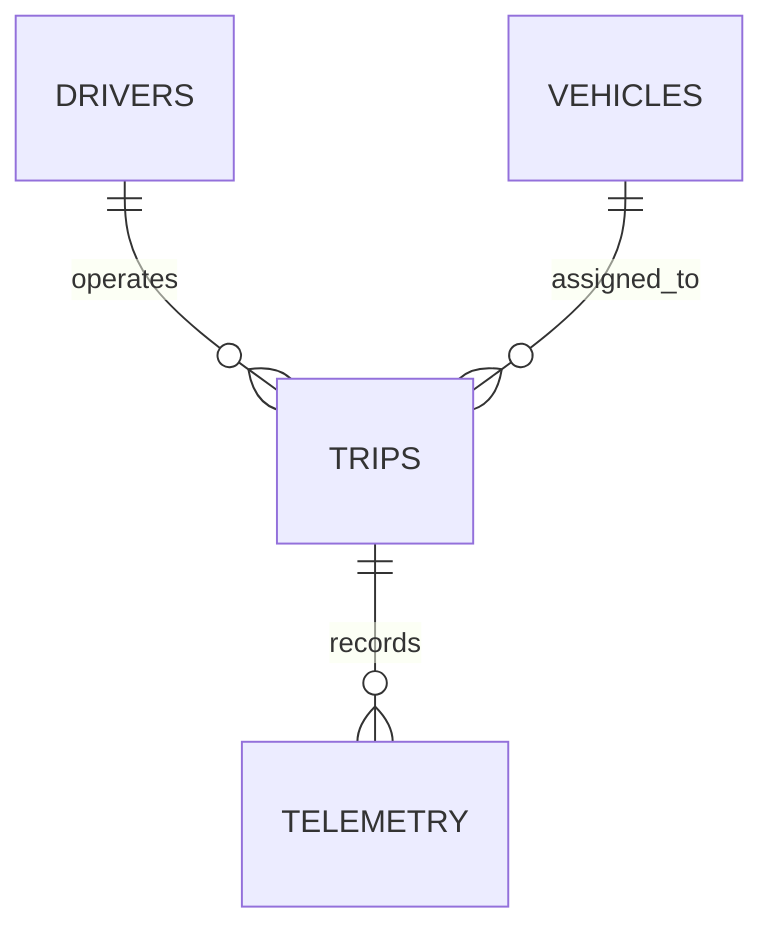
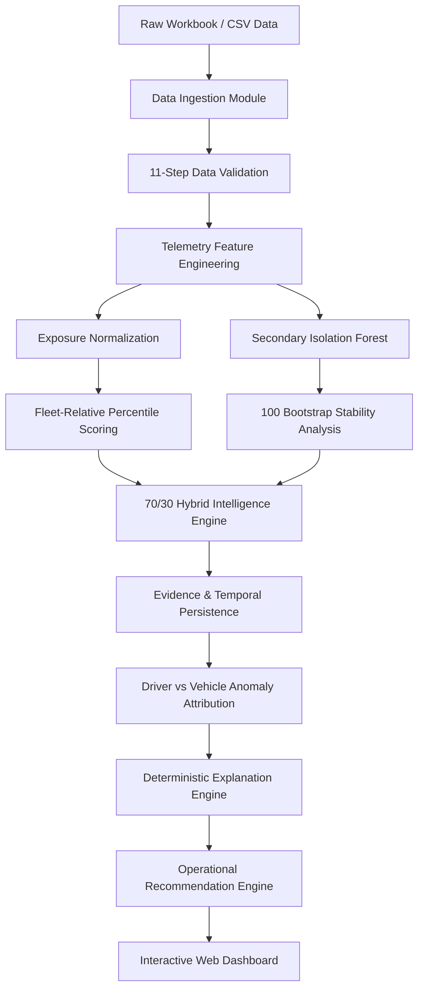
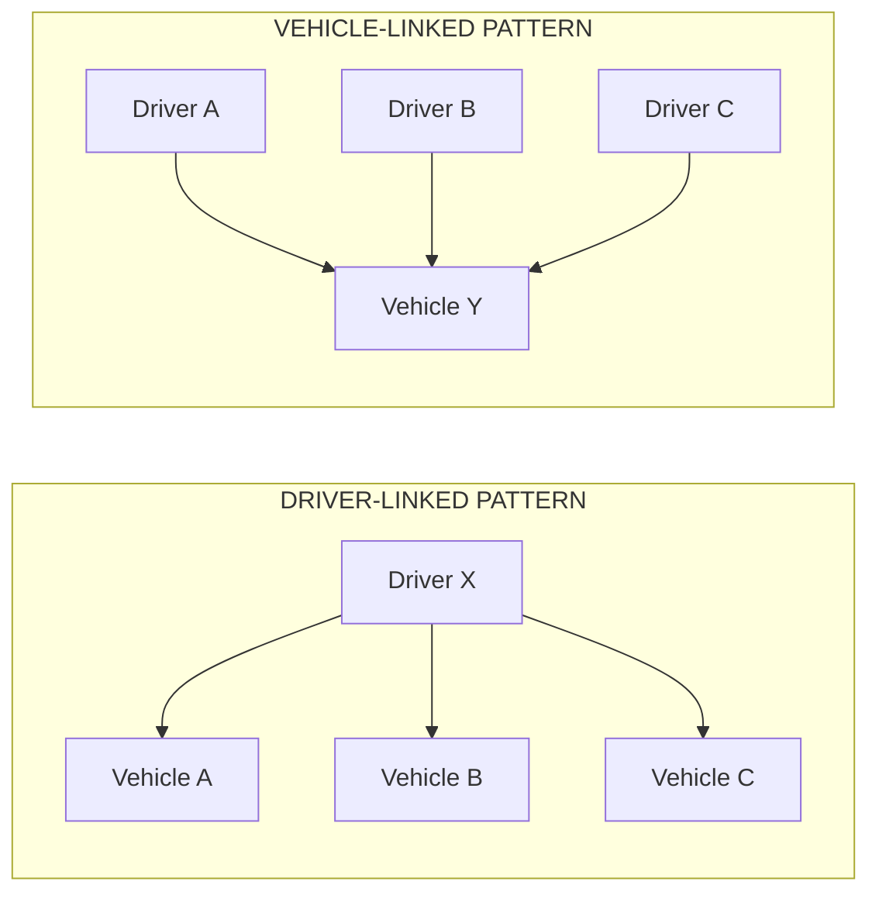

# VEXAR Fleet Intelligence

An explainable fleet intelligence system that analyzes driver behaviour and vehicle telemetry to surface fleet-relative operational signals.


---

## Live Demo

Local demo available — see [Setup Instructions](#setup-instructions) below.

---

## Repository

This repository contains the complete end-to-end analytical pipeline, unsupervised machine learning models, deterministic explanation engines, automated validation suites, and an interactive web dashboard for **VEXAR Fleet Intelligence**.

---

## What does this project do?

Fleet operations generate large amounts of trip and telemetry data, but raw sensor readings are difficult to translate into operational decisions.

This project turns raw 1-minute IMU and GPS telemetry into two explainable intelligence layers:

### Driver Behaviour Intelligence
Identifies unusual fleet-relative behavioural patterns using:
- Speed instability (standard deviation of speed)
- Upper-tail speed behaviour (95th percentile speed)
- Acceleration behaviour (dynamic acceleration deviation)
- Rotational movement (95th percentile gyroscope magnitude)
- Exposure-normalized event rates (accel/gyro extreme events per driving hour)
- Temporal persistence (ratio of active days with elevated metrics)

### Vehicle Inspection Intelligence
Identifies vehicles with unusual telemetry patterns that may warrant inspection using:
- Acceleration vibration deviation (mean dynamic acceleration deviation)
- Extreme vibration rate (vibration spikes per driving hour)
- Rotational behaviour (gyroscope magnitude)
- Cross-driver persistence (recurrence across multiple operating drivers)
- Maintenance context (vehicle age, odometer reading, and days since service)

> **Key Analytical Boundary**: The resulting signals are relative to the observed fleet. They are **not** accident probabilities or mechanical failure probabilities.

---

## Problem

A commercial two-wheeler fleet operator manages drivers, vehicles, trips, and telemetry. Simply reviewing raw sensor readings or raw event counts does not answer critical operational questions:

- **Which drivers show unusual behavioural patterns relative to their peers?**
- **Which vehicles show unusual sensor vibration patterns that warrant inspection?**
- **Is an observed anomaly associated with a driver's handling style or a vehicle's mechanical condition?**
- **How strong is the empirical evidence supporting an observed signal?**
- **What specific action should a fleet manager consider?**

This system answers these questions while strictly respecting what the dataset can support without fabricating ungrounded causal claims.

---

## Dataset

The analysis is performed on one week of commercial two-wheeler fleet data:

| Entity / Table | Records | Evaluated Attributes | Purpose |
| :--- | :---: | :---: | :--- |
| **Drivers** | 30 | 8 | Driver profile & experience metadata |
| **Vehicles** | 30 | 8 | Vehicle master, age, odometer, and service recency |
| **Trips** | 450 | 14 | Trip operational boundaries (timestamps, distance, duration) |
| **Telemetry** | 12,987 | 13 | Minute-level 3-axis accelerometer, gyroscope, speed, and GPS logs |

### Dataset Parameters
- **Observation Window**: `2026-07-31` → `2026-08-06` (7 days)
- **Total Completed Trips**: 450 trips
- **Total Driving Hours**: 216.45 hours
- **Total Distance Traveled**: 6,151.68 km
- **Telemetry Sampling Frequency**: Approximately 1 record per minute

---

## Data Relationships



### Relational Integrity Rules
- Each `Trip` is linked to exactly one `Driver_ID` and one `Vehicle_ID`.
- Each `Telemetry` entry belongs to a valid `Trip_ID` with timestamps bounded inside the trip start and end times.
- Telemetry `Driver_ID` and `Vehicle_ID` entries were cross-validated against referenced trip records to ensure zero context mismatch.

---

## Data Validation

Before modeling, raw data passes through an automated **11-Step Non-Destructive Data Validation Pipeline** ([`src/validation/validator.py`](file:///C:/Users/Kanishka/.gemini/antigravity/scratch/VEXAR-Fleet-Intelligence/src/validation/validator.py)):

1. **Schema Validation**: Correct column names and data types across all 4 tables.
2. **Primary Key Uniqueness**: Zero duplicate IDs in `Drivers`, `Vehicles`, or `Trips`.
3. **Telemetry Composite Key Validation**: Composite key (`Trip_ID` + `Timestamp`) uniqueness.
4. **Missing Value Audit**: 0 missing values across critical telemetry axes ($A_x, A_y, A_z, G_x, G_y, G_z, \text{Speed}$).
5. **Duplicate Detection**: 0 duplicate telemetry rows.
6. **Foreign Key Integrity**: 100% referential integrity between `Telemetry`, `Trips`, `Drivers`, and `Vehicles`.
7. **Telemetry Context Consistency**: 0 mismatched `Driver_ID` or `Vehicle_ID` pairs between telemetry and trip tables.
8. **Timestamp Integrity**: Telemetry timestamps strictly monotonic per trip.
9. **Trip Logical Sanity**: `Trip_End_Time` > `Trip_Start_Time` across all 450 trips.
10. **GPS Bounds**: Coordinates bounded inside the valid fleet operating region.
11. **Telemetry Physical Sanity**: Validated sensor ranges (Speed: 0–80 km/h, Gyro: 0–300 dps).

> **Validation Result**: 11 out of 11 validation checks passed with 100% clean data integrity.

---

## End-to-End Pipeline



### Stage Overview
- **Ingestion & Validation**: Loads raw tables and executes non-destructive schema and boundary verification.
- **EDA & Feature Engineering**: Decomposes 3-axis accelerometer telemetry into dynamic gravity deviation and computes exposure rates.
- **Scoring & Anomaly Modeling**: Combines linear fleet-relative percentiles with an unsupervised Isolation Forest.
- **Attribution & Explainability**: Evaluates cross-assignment recurrence and outputs deterministic, human-readable explanations.
- **Dashboard Presentation**: Presents intelligence through a responsive React TypeScript user interface.

---

## Feature Engineering

### Speed Features
- **Speed Variability**: Mean standard deviation of speed per trip ($\text{speed\_std\_mean}$).
- **Upper-Tail Speed**: Mean 95th percentile speed per trip ($\text{speed\_p95\_mean}$).

### Accelerometer Features
Dynamic acceleration deviation measures motion intensity relative to nominal gravity:
$$||A_{\text{raw}}|| = \sqrt{A_x^2 + A_y^2 + A_z^2}$$
$$||A_{\text{grav\_dev}}|| = | ||A_{\text{raw}}|| - 1.0086\text{g} |$$

> **Why Deviation from Nominal Gravity Baseline?**: Static Earth gravity ($\sim 1.0\text{g}$) exerts a constant force on raw vertical accelerometer axes. Subtracting the empirically observed fleet baseline median ($1.0086\text{g}$) isolates dynamic vehicle motion, acceleration, braking, and road surface vibration from static gravitational tilt.

### Gyroscope Features
Rotational motion magnitude captures cornering and rotational intensity:
$$||G_{\text{raw}}|| = \sqrt{G_x^2 + G_y^2 + G_z^2}$$
- **Upper-Tail Rotational Rate**: Mean 95th percentile gyroscope magnitude ($\text{gyro\_mag\_p95\_mean}$).

### Exposure Normalization
Raw event counts artificially penalize drivers or vehicles operating longer trips. To ensure fair fleet comparisons:
$$\text{Accel Extremes / Hr} = \frac{\text{Count}(||A_{\text{grav\_dev}}|| > P_{90})}{\text{Driving Hours}}$$
$$\text{Gyro Extremes / Hr} = \frac{\text{Count}(||G_{\text{raw}}|| > P_{90})}{\text{Driving Hours}}$$

---

## Driver Behaviour Intelligence

Driver score ($0 - 100$) evaluates behavioral variability relative to the rest of the fleet across 6 components:

1. **Speed Instability** (20%): Standard deviation of speed ($P_{\text{fleet}}$).
2. **Speed Tail** (20%): 95th percentile speed ($P_{\text{fleet}}$).
3. **Acceleration Deviation** (20%): Dynamic acceleration magnitude deviation ($P_{\text{fleet}}$).
4. **Rotational Rate** (15%): 95th percentile gyroscope magnitude ($P_{\text{fleet}}$).
5. **Exposure Event Rate** (15%): Acceleration extremes per driving hour ($P_{\text{fleet}}$).
6. **Temporal Persistence** (10%): Ratio of active days where driver metrics exceeded the fleet 75th percentile.

$$\text{Interpretable Driver Score} = 0.20 P_{\text{speed\_std}} + 0.20 P_{\text{speed\_p95}} + 0.20 P_{\text{accel\_dev}} + 0.15 P_{\text{gyro\_p95}} + 0.15 P_{\text{accel\_rate}} + 0.10 P_{\text{persistence}}$$

---

## Vehicle Inspection Intelligence

Vehicle score ($0 - 100$) evaluates telemetry vibration patterns relative to peer vehicles across 5 components:

1. **Acceleration Vibration Deviation** (30%): Dynamic acceleration deviation ($P_{\text{fleet}}$).
2. **Extreme Vibration Rate** (25%): Acceleration extreme spikes per driving hour ($P_{\text{fleet}}$).
3. **Rotational Rate** (25%): 95th percentile gyroscope magnitude ($P_{\text{fleet}}$).
4. **Maintenance Context** (20%): Contextual score combining vehicle age, odometer, and days since service.
5. **Cross-Driver Persistence**: Recurrence of elevated sensor vibration across multiple distinct operating drivers.

$$\text{Interpretable Vehicle Score} = 0.30 P_{\text{accel\_vibr}} + 0.25 P_{\text{vibr\_rate}} + 0.25 P_{\text{gyro\_rot}} + 0.20 P_{\text{maint\_context}}$$

> **Contextual Separation Rule**: Maintenance information is treated strictly as **Contextual Evidence** ($20\%$) and is **never** presented as proof of mechanical defect. Observed sensor vibration remains primary ($80\%$).

---

## Hybrid Intelligence Model

To combine linear explainability with multi-dimensional pattern detection, the system uses a hybrid score:

$$\text{Hybrid Intelligence Signal} = 0.70 \times \text{Interpretable Fleet Score} + 0.30 \times \text{Isolation Forest Score}$$

### Rationale & Model Comparison
The 70/30 hybrid configuration was selected based on stability and interpretability analysis performed on this dataset:

| Weighting Scheme | Interpretable Wt | Isolation Forest Wt | Driver Rank Correlation | Vehicle Rank Correlation | Selection Rationale |
| :--- | :---: | :---: | :---: | :---: | :--- |
| **100/0** | 1.00 | 0.00 | 1.0000 | 1.0000 | Pure linear interpretable baseline |
| **80/20** | 0.80 | 0.20 | 0.9842 | 0.9810 | High stability; minor non-linear adjustment |
| **70/30 (SELECTED)** | **0.70** | **0.30** | **0.9585** | **0.9520** | **Selected candidate: maintains >0.95 correlation while capturing non-linear interactions** |
| **60/40** | 0.60 | 0.40 | 0.9120 | 0.9045 | Begins to degrade linear explainability |

---

## Why Isolation Forest?

Isolation Forest is an unsupervised anomaly detection algorithm that isolates observations by randomly selecting a feature and splitting on a random value. Because anomalies require fewer splits to isolate, they appear closer to the root of the decision trees.

In this system, Isolation Forest evaluates multi-dimensional feature combinations without requiring labeled accident or failure data.

### Stability Audit (100 Bootstrap Iterations)
The model was tested across a contamination hyperparameter grid ($\in \{0.05, 0.10, 0.15\}$) with 100 bootstrap resampling iterations:

| Audit Metric | Spearman Rank Correlation ($r$) | Empirical Interpretation |
| :--- | :---: | :--- |
| **Driver Contamination Sensitivity (0.05 vs 0.10)** | **0.9842** | Extremely high rank invariance across hyperparameter choices |
| **Driver Contamination Sensitivity (0.10 vs 0.15)** | **0.9785** | Consistent top-rank identification |
| **Driver Bootstrap Mean Correlation (100 Runs)** | **0.9614** | Robust against random sub-sampling noise |
| **Vehicle Contamination Sensitivity (0.05 vs 0.10)** | **0.9810** | Stable vehicle ranking |
| **Vehicle Contamination Sensitivity (0.10 vs 0.15)** | **0.9752** | Stable vehicle ranking |
| **Vehicle Bootstrap Mean Correlation (100 Runs)** | **0.9548** | Robust against random sub-sampling noise |

---

## Evidence, Persistence & Uncertainty

Every signal is categorized into an evidence strength bucket:
- **LOW**: Single-trip spike or limited repeated evidence ($<25\%$ elevated day ratio). Treat as an observation rather than a conclusion.
- **MEDIUM**: Moderate persistence ($25\% - 50\%$ elevated day ratio) or partial cross-assignment recurrence.
- **HIGH**: Strong persistence ($>50\%$ elevated day ratio) and verified cross-assignment recurrence.

> **Uncertainty Principle**: The system does **not** force an explanation when the available evidence is insufficient. Isolated single-trip anomalies are explicitly flagged as `INSUFFICIENT EVIDENCE FOR ATTRIBUTION`.

---

## Driver vs Vehicle Attribution

Across 77 candidate anomalous trips (top 10% rate tail), the attribution engine evaluates cross-assignment patterns:



### Attribution Categories & Fleet Results
- **`DRIVER-LINKED PATTERN`** (3 trips / 3.9%): Anomaly recurs for the same driver across multiple distinct vehicles. Consistent with rider handling style.
- **`VEHICLE-LINKED PATTERN`** (17 trips / 22.1%): Anomaly recurs on the same vehicle across multiple distinct drivers. Candidate for mechanical/suspension inspection.
- **`JOINT CO-OCCURRENCE`** (1 trip / 1.3%): Anomaly present in both driver and vehicle independent elevated histories.
- **`INSUFFICIENT EVIDENCE`** (56 trips / 72.7%): Isolated single-trip spikes without repeated cross-assignment proof. Intentionally left unattributed to avoid ungrounded causal claims.

---

## Explainability

Rather than returning raw scores, the engine generates deterministic, human-readable explanations ([`src/modeling/explanation_engine.py`](file:///C:/Users/Kanishka/.gemini/antigravity/scratch/VEXAR-Fleet-Intelligence/src/modeling/explanation_engine.py)):

```json
{
  "Driver_ID": "D23",
  "Hybrid_Signal": 93.2,
  "Evidence_Strength": "HIGH",
  "Attribution": "DRIVER-LINKED PATTERN",
  "Primary_Reason": "Speed instability is at the top end of the observed fleet distribution (std: 14.82 km/h).",
  "Secondary_Reason": "Upper-tail speed behaviour is at the 96.6th percentile (P95: 58.40 km/h).",
  "Operational_Explanation": "Driver D23 exhibits consistent speed instability across multiple vehicles, indicating a rider handling pattern suitable for coaching review.",
  "Recommended_Action": "Behavioral Coaching Review"
}
```

---

## Dashboard

The Stage 4 Web Application provides 5 dedicated views:

1. **Fleet Overview** (`/`): Executive summary, 6 fleet KPIs, driver/vehicle coaching & inspection counts, dynamic top signal cards, workflow diagram, and uncertainty breakdown.
2. **Driver Intelligence** (`/drivers`): Complete 30-driver table with filters (Action, Evidence, Attribution) and sorting.
3. **Driver Detail** (`/drivers/:id`): Driver deep dive with 6-component percentile chart, explainability card, 7-day activity, and vehicles driven.
4. **Vehicle Inspection** (`/vehicles`): Complete 30-vehicle table with service recency filters (`>180 days`) and inspection signals.
5. **Vehicle Detail** (`/vehicles/:id`): Vehicle deep dive with visually separated **Observed Sensor Signals** and **Contextual Maintenance Information**, plus operating drivers list.
6. **Anomaly Attribution** (`/attribution`): Attribution matrix, 77 candidate trips table, and uncertainty breakdown.
7. **Methodology & Audit** (`/methodology`): 12-step educational accordion, 70/30 hybrid rationale table, and bootstrap stability report.

---

## Current Fleet Findings

### Driver Behaviour Intelligence (30 Drivers)
- **Focused Coaching Review**: 2 drivers (`D24`, `D07`) — High signal, High evidence, Driver-linked attribution.
- **Behavioral Coaching Review**: 10 drivers (`D23`, `D19`, `D14`, `D06`, `D27`, `D01`, `D20`, `D10`, `D25`, `D22`).
- **Routine Performance Monitoring**: 15 drivers.
- **Standard Monitoring / Low Evidence**: 3 drivers.

### Vehicle Health Inspection (30 Vehicles)
- **Priority Mechanical / Suspension Inspection**: 4 vehicles (`V02`, `V19`, `V14`, `V23`) — High signal, High evidence, Vehicle-linked attribution / elevated service interval.
- **Routine Fleet Service Inspection**: 8 vehicles (`V12`, `V27`, `V06`, `V10`, `V01`, `V24`, `V16`, `V28`).
- **Routine Fleet Monitoring**: 14 vehicles.
- **Standard Monitoring / Insufficient Evidence**: 4 vehicles.

---

## Limitations

1. **Short Observation Period**: 7 days of telemetry is insufficient for long-term component degradation or seasonal trend modeling.
2. **Absence of Ground-Truth Labels**: Zero accident or maintenance logs mandate relative-risk framing rather than classification probabilities.
3. **1-Minute Telemetry Resolution**: High-frequency sub-second shocks are averaged over 60-second intervals.
4. **Sensor Orientation Sensitivity**: IMU readings reflect phone/device mounting tilt in addition to vehicle frame dynamics.
5. **Fleet-Relative Ranks**: High scores indicate unusual behaviour *relative to this specific 30-vehicle fleet*, not absolute physical safety thresholds.
6. **Correlation vs Causality**: Attribution identifies repeated cross-assignment association, not mechanical causality.
7. **Contextual Maintenance Limits**: Service recency provides context but does not prove mechanical failure.

---

## Future Improvements

- Historical observation windows ($30+$ days) for trend detection.
- Ingestion of real maintenance logs and crash incident records for supervised model calibration.
- Sub-second high-frequency IMU burst sampling for transient shock classification.
- Real-time streaming ingestion using Apache Kafka or AWS Kinesis.
- Continuous model drift monitoring and automated retraining pipelines.
- Direct API integration with fleet management systems (Geotab, Samsara).

---

## Project Structure

```
VEXAR-Fleet-Intelligence/
├── data/
│   ├── raw/                        # Excel & CSV raw tables (Drivers, Vehicles, Trips, Telemetry)
│   └── processed/                  # Validation reports, feature tables, and scored CSV outputs
├── docs/                           # Technical documentation & EDA findings report
├── notebooks/                      # Exploratory Data Analysis & validation Jupyter notebooks
├── outputs/
│   ├── figures/                    # 17 visual figures (distributions, heatmaps, sensitivity)
│   └── reports/                    # Stage 3 modeling markdown reports
├── scratch/                        # Execution scripts (run_stage3.py, build_notebooks.py)
├── src/
│   ├── analysis/                   # Attribution and EDA analysis modules
│   ├── components/                 # React UI components (Header, Sidebar, MetricCard)
│   ├── data/                       # Frontend data loader and clean JSON dataset (fleetData.json)
│   ├── ingestion/                  # Data loading and schema parsing modules
│   ├── modeling/                   # Scoring engines, Isolation Forest, validation suite
│   ├── pages/                      # Dashboard page views (Overview, Drivers, Vehicles, Attribution, Methodology)
│   ├── preprocessing/              # Telemetry transformation & gravity magnitude decomposition
│   └── validation/                 # 11-step automated data validator
├── index.html                      # Vite HTML entry point
├── package.json                    # Node.js dependencies and build scripts
├── README.md                       # Project master documentation
├── requirements.txt                # Python package dependencies
├── tailwind.config.js              # Tailwind CSS configuration
├── tsconfig.json                   # TypeScript compiler configuration
└── vite.config.ts                  # Vite build configuration
```

---

## Setup Instructions

### Prerequisites
- **Python**: Version 3.12 or higher
- **Node.js**: Version 18.0 or higher (with npm)

### 1. Clone Repository
```bash
git clone https://github.com/Kanishka16garg/VEXAR-Fleet-Intelligence.git
cd VEXAR-Fleet-Intelligence
```

### 2. Python Modeling Environment Setup
```bash
# Create virtual environment (optional)
python -m venv venv
source venv/bin/activate  # On Windows: venv\Scripts\activate

# Install dependencies
pip install -r requirements.txt

# Run Python data validation & modeling pipeline
python scratch/run_stage3.py
```

### 3. Frontend Web Dashboard Setup
```bash
# Install Node dependencies
npm install

# Build production bundle
npm run build

# Launch local preview server
npm run preview
```
Open **`http://localhost:4173/`** (or `http://localhost:5173/` for dev mode `npm run dev`) in any web browser.

---

## Technology Stack

| Layer | Technology | Version | Purpose |
| :--- | :--- | :---: | :--- |
| **Language** | Python | 3.12 | Core data processing and unsupervised ML |
| **Data Manipulation** | Pandas, NumPy | 2.2 / 1.26 | Telemetry feature engineering & percentile scoring |
| **Statistical Computing** | SciPy | 1.13 | Spearman rank correlations & distribution analytics |
| **Machine Learning** | Scikit-Learn | 1.5 | Unsupervised Isolation Forest anomaly detection |
| **Visualization** | Matplotlib, Seaborn | 3.9 / 0.13 | Publication-quality static figure generation |
| **Frontend Framework** | React, TypeScript | 18.0 / 5.5 | Interactive dashboard UI & type-safe data loader |
| **Build Tool & Styling** | Vite, Tailwind CSS | 5.4 / 3.4 | Rapid bundler & responsive dark-mode UI styling |
| **UI Components** | Recharts, Lucide Icons | 2.12 / 0.424 | Interactive charts & SVG iconography |

---

## Engineering Highlights

- **100% Reproducible Data Pipeline**: End-to-end execution from raw CSVs to JSON dataset via a single Python runner (`scratch/run_stage3.py`).
- **Automated Validation Assertions**: 10 automated model output assertions guaranteeing bounded scores, 0 NaNs, demographic exclusion, and non-causal wording compliance.
- **Domain-Informed Feature Engineering**: Dynamic acceleration magnitude decomposition isolating vehicle dynamics from static Earth gravity tilt.
- **Uncertainty-Aware Attribution Engine**: Intentionally leaves 56 isolated trip spikes unattributed rather than making ungrounded causal claims.
- **Deterministic Explanation Engine**: Generates reproducible human-readable explanations without external LLM dependencies.

---

## Design Principle

> **"Prefer evidence over assumptions."**

The system follows a strict non-causal progression:
$$\text{OBSERVATION} \longrightarrow \text{EVIDENCE} \longrightarrow \text{ATTRIBUTION} \longrightarrow \text{RECOMMENDATION}$$

Rather than assuming:
$$\text{OBSERVATION} \longrightarrow \text{ASSUMED CAUSE}$$

---

## About

This project was developed as part of the **VexarDrive Technologies Data Engineering Intern Selection Assignment** by **Kanishka Garg**.

- **GitHub Repository**: [Kanishka16garg/VEXAR-Fleet-Intelligence](https://github.com/Kanishka16garg/VEXAR-Fleet-Intelligence)
