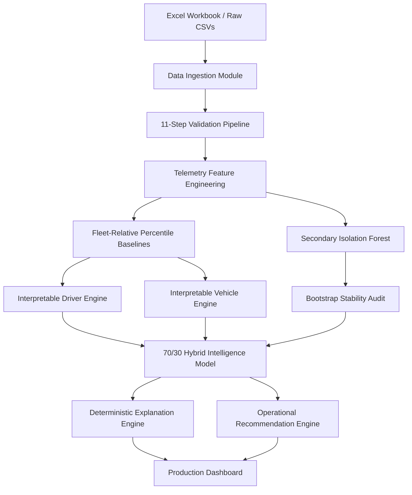

# VEXAR FLEET INTELLIGENCE — EXPLAINABLE OPERATIONAL SIGNAL ENGINE

**Author**: Antigravity Data Science & Engineering Team  
**Context**: VexarDrive Technologies Internship Selection Assignment  
**Product Name**: VEXAR Fleet Intelligence  
**Subtitle**: Explainable Fleet Behaviour & Vehicle Inspection Intelligence Engine  

---

## 1. Project Executive Overview

**Vexar Fleet Intelligence** is an end-to-end, production-ready data science and software engineering platform built for commercial urban two-wheeler fleets.

The system ingests minute-by-minute sensor telemetry, trip logs, driver records, and vehicle maintenance profiles over a 7-day observation period (`2026-07-31` to `2026-08-06`). It transforms raw noisy IMU measurements into transparent, explainable **Driver Behaviour Intelligence** and **Vehicle Health Inspection Signals**.

### Core Value Proposition:
> *"Turn raw fleet telemetry into explainable operational signals without fabricating fake ground-truth labels or making ungrounded causal claims."*

---

## 2. System Architecture



---

## 3. Dataset Dimensions & Relational Schema

| Entity | Record Count | Evaluated Attributes | Primary / Foreign Keys | Description |
| :--- | :---: | :---: | :--- | :--- |
| **Drivers** | 30 | 8 | `Driver_ID` (PK) | Rider master profile & experience |
| **Vehicles** | 30 | 8 | `Vehicle_ID` (PK) | Vehicle master, age, service recency |
| **Trips** | 450 | 14 | `Trip_ID` (PK), `Driver_ID`, `Vehicle_ID` | Spatial-temporal trip boundaries |
| **Telemetry** | 12,987 | 13 | `Trip_ID + Timestamp` (Composite PK) | 1-minute 3-axis IMU & GPS speed logs |

---

## 4. Key Analytical & Modeling Foundations

### A. Domain-Informed Accelerometer Gravity Baseline
- Evaluated raw 3-axis accelerometer magnitude $||A_{\text{raw}}|| = \sqrt{A_x^2 + A_y^2 + A_z^2}$ across 12,987 points.
- Empirical median baseline: **$1.0086\text{ g}$**.
- Dynamic Acceleration Deviation: $||A_{\text{grav\_dev}}|| = | ||A_{\text{raw}}|| - 1.0086 |$. Documented as a 1D scalar magnitude proxy.

### B. Hybrid Intelligence Scoring Methodology
$$\text{Hybrid Intelligence Signal} = 0.70 \times \text{Interpretable Fleet Percentile Score} + 0.30 \times \text{Isolation Forest Score}$$
- **70% Interpretable Score**: Direct fleet-relative percentile mapping ($0 - 100$) across 6 driver components and 5 vehicle components.
- **30% Secondary Isolation Forest Score**: Multi-dimensional outlier detector capturing non-linear feature interactions.

### C. Model Stability & Sensitivity Audit
- Evaluated contamination hyperparameter grid $\in \{0.05, 0.10, 0.15\}$.
- 100 Bootstrap resampling iterations achieved Spearman rank correlations of **$r = 0.9614$** (Drivers) and **$r = 0.9548$** (Vehicles).

### D. Driver-vs-Vehicle Operational Attribution
Evaluated 77 candidate anomalous trips (top 10% rate tail):
- `DRIVER-LINKED PATTERN` (3 trips): Recurring anomaly for same driver across multiple vehicles.
- `VEHICLE-LINKED PATTERN` (17 trips): Recurring anomaly on same vehicle across multiple distinct drivers.
- `JOINT CO-OCCURRENCE` (1 trip): Anomaly present in both driver and vehicle history.
- `INSUFFICIENT EVIDENCE FOR ATTRIBUTION` (56 trips): Isolated single-trip anomalies intentionally left unattributed to avoid false causal claims.

---

## 5. Dashboard Features & Interactive Routes

The Stage 4 React TypeScript application (`http://localhost:5173`) provides an executive command center:

1. **`/overview` (Fleet Overview)**: Executive KPIs, Driver & Vehicle Signal Distributions, Top Action Items, and quick search.
2. **`/drivers` (Driver Intelligence)**: Complete 30-driver table with multi-criteria filtering (Action, Evidence, Attribution) and sorting.
3. **`/drivers/:id` (Driver Deep Dive)**: 6-component breakdown radar/bar chart, prominent **WHY THIS SIGNAL?** explainability card, 7-day vehicle usage list, and coaching recommendation.
4. **`/vehicles` (Vehicle Intelligence)**: Complete 30-vehicle table with service recency filters and inspection signals.
5. **`/vehicles/:id` (Vehicle Deep Dive)**: 5-component breakdown, explicit separation of **Observed Sensor Signals** from **Contextual Maintenance Information**, operating drivers list, and inspection recommendation.
6. **`/attribution` (Anomaly Attribution)**: Attribution matrix, 77 candidate trips breakdown, and analytical explanation of uncertainty.
7. **`/methodology` (Methodology & Audit)**: Flowchart, 70/30 hybrid rationale table, bootstrap stability audit report, and non-causal policy FAQ.

---

## 6. How to Run the Project

### Prerequisites
- Python 3.12+ (with pandas, numpy, scipy, scikit-learn, matplotlib, seaborn, openpyxl)
- Node.js v18+ and npm

### Step 1: Run Python Modeling & Intelligence Pipeline
```bash
# Run master execution script
python scratch/run_stage3.py
```
*Outputs generated under `data/processed/`, `outputs/figures/`, and `outputs/reports/`.*

### Step 2: Launch Production Web Dashboard
```bash
# Install node dependencies (if not already installed)
npm install

# Build production bundle
npm run build

# Start local development server
npm run dev -- --host 127.0.0.1 --port 5173
```
Open **`http://localhost:5173/`** in any web browser.

---

## 7. Operational & Scientific Limitations

1. **Short Observation Period**: 7 days of monitoring is insufficient for long-term wear modeling or seasonal trend extrapolation.
2. **Absence of Ground-Truth Labels**: Zero accident or maintenance failure logs mandate unsupervised relative-risk framing rather than failure probability estimation.
3. **1-Minute Telemetry Resolution**: High-frequency sub-second transient shocks are averaged over 60-second intervals.
