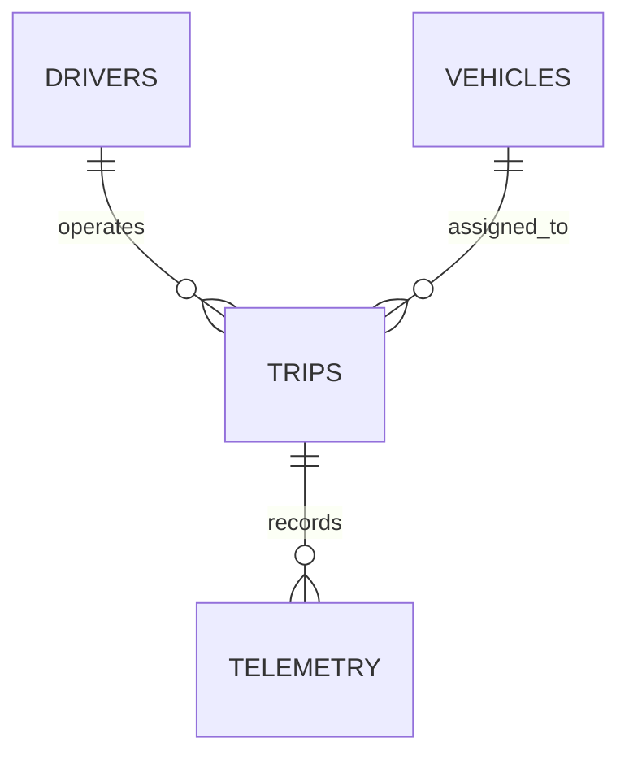
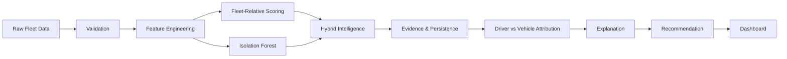

# VEXAR Fleet Intelligence

> An explainable fleet intelligence system that analyzes driver behaviour and vehicle telemetry to surface fleet-relative operational signals.


Fleet operations generate large amounts of trip and telemetry data, but raw sensor readings are difficult to translate into operational decisions.

VEXAR Fleet Intelligence converts this telemetry into two explainable intelligence layers:
- **Driver Behaviour Intelligence**: Surfaces unusual driver handling patterns for coaching.
- **Vehicle Inspection Intelligence**: Surfaces vehicles showing unusual vibration patterns for maintenance inspection.

> **Important Boundary**: These are fleet-relative operational signals, **NOT** accident probabilities or mechanical failure probabilities.

---

## Problem

Fleet operators manage drivers, vehicles, trips, and telemetry. Raw sensor data alone does not provide direct operational answers:

- Which drivers show unusual behaviour relative to peers?
- Which vehicles show unusual telemetry patterns that may warrant inspection?
- Does an anomaly appear to follow a driver or a vehicle?
- How strong is the empirical evidence?
- What specific action should an operator consider?

The system is deliberately designed to avoid unsupported causal claims.

---

## Dataset

Analysis is performed on one week of urban commercial two-wheeler fleet data:

| Table | Records | Purpose |
| :--- | :---: | :--- |
| **Drivers** | 30 | Driver profile & experience metadata |
| **Vehicles** | 30 | Vehicle information, age, odometer, service recency |
| **Trips** | 450 | Trip-level operational data (timestamps, distance, duration) |
| **Telemetry** | 12,987 | Minute-level 3-axis IMU & GPS sensor data |

- **Observation window**: `2026-07-31` → `2026-08-06` (7 days)
- **Total driving time**: 216.45 hours
- **Distance**: 6,151.68 km
- **Telemetry resolution**: Approximately 1 record/minute



---

## How It Works



1. **Validation**: 11-step automated checks verify schema, referential integrity, missing values, and physical sanity bounds.
2. **Feature Engineering**: Decomposes 3-axis IMU readings and computes exposure-normalized event rates.
3. **Fleet-Relative Scoring**: Calculates linear percentile ranks ($0-100$) relative to peer drivers and vehicles.
4. **Isolation Forest**: Fits a secondary unsupervised anomaly detection model to detect multi-dimensional feature interactions.
5. **Hybrid Intelligence**: Blends 70% interpretable percentile scores with 30% Isolation Forest scores.
6. **Evidence & Persistence**: Evaluates temporal persistence and categorizes evidence strength (LOW, MEDIUM, HIGH).
7. **Attribution**: Evaluates cross-assignment recurrence to identify Driver-linked vs Vehicle-linked patterns.
8. **Explanation & Action**: Generates deterministic, human-readable explanations and operational action recommendations.
9. **Dashboard**: Presents intelligence through a responsive React TypeScript command center.

---

## Feature Engineering

- **Speed Features**: Speed variability (std) and upper-tail speed (95th percentile).
- **Accelerometer Features**: Dynamic acceleration deviation from nominal Earth gravity baseline ($1.0086\text{g}$):
  $$||A_{\text{grav\_dev}}|| = | \sqrt{A_x^2 + A_y^2 + A_z^2} - 1.0086\text{g} |$$
  *Subtracting nominal gravity isolates dynamic vehicle motion from static tilt.*
- **Gyroscope Features**: 95th percentile rotational motion magnitude.
- **Exposure Normalization**: Event rates normalized per driving hour and per 100 km to prevent longer trips from artificially skewing anomaly counts.

---

## Intelligence & Scoring

### Driver Behaviour Score (0–100)
Combines 6 fleet-relative percentiles ($P_{\text{fleet}}$):
$$\text{Driver Score} = 0.20 P_{\text{speed\_std}} + 0.20 P_{\text{speed\_p95}} + 0.20 P_{\text{accel\_dev}} + 0.15 P_{\text{gyro\_p95}} + 0.15 P_{\text{accel\_rate}} + 0.10 P_{\text{persistence}}$$

### Vehicle Inspection Score (0–100)
Combines 5 fleet-relative percentiles ($P_{\text{fleet}}$):
$$\text{Vehicle Score} = 0.30 P_{\text{accel\_vibr}} + 0.25 P_{\text{vibr\_rate}} + 0.25 P_{\text{gyro\_rot}} + 0.20 P_{\text{maint\_context}}$$
*Maintenance information (age, odometer, days since service) is treated strictly as contextual evidence ($20\%$). Sensor evidence remains primary ($80\%$).*

### Hybrid Intelligence Model
$$\text{Hybrid Signal} = 0.70 \times \text{Interpretable Score} + 0.30 \times \text{Isolation Forest Score}$$
*The 70/30 configuration was selected based on stability and interpretability analysis on this dataset ($r = 0.9585$ Drivers / $r = 0.9520$ Vehicles relative to pure linear baseline).*

---

## Explainability & Attribution

### Evidence & Persistence
- **LOW**: Limited repeated evidence; treat as observation.
- **MEDIUM**: Moderate temporal persistence ($25-50\%$ elevated day ratio).
- **HIGH**: Strong persistence ($>50\%$ elevated day ratio) and verified cross-assignment recurrence.

### Operational Anomaly Attribution (77 Candidate Trips)
- **`DRIVER-LINKED PATTERN`** (3 trips / 3.9%): Recurring anomaly for the same driver across multiple distinct vehicles.
- **`VEHICLE-LINKED PATTERN`** (17 trips / 22.1%): Recurring anomaly on the same vehicle across multiple operating drivers.
- **`JOINT CO-OCCURRENCE`** (1 trip / 1.3%): Anomaly present in both driver and vehicle independent histories.
- **`INSUFFICIENT EVIDENCE`** (56 trips / 72.7%): Isolated single-trip spikes. Intentionally left unattributed to avoid ungrounded assumptions.

### Deterministic Explanations
Explanations are template-driven and fully reproducible without LLM dependencies.

---

## Dashboard

The React TypeScript web application features 5 interactive views:

- **Fleet Overview**: Executive KPIs, top ranked driver/vehicle signals, workflow diagram, and uncertainty breakdown.
- **Driver Intelligence**: Complete 30-driver table with multi-criteria filtering and sorting.
- **Vehicle Inspection**: Complete 30-vehicle table with service recency filters.
- **Anomaly Attribution**: 77 candidate trips matrix and attribution category breakdown.
- **Methodology & Audit**: 12-step educational accordion, 70/30 hybrid rationale table, and bootstrap stability report.

---

## Key Results

### Driver Behaviour Intelligence (30 Drivers)
- **Focused Coaching Review**: 2 drivers (`D24`, `D07`)
- **Behavioral Coaching Review**: 10 drivers
- **Routine Performance Monitoring**: 15 drivers
- **Standard Monitoring / Low Evidence**: 3 drivers

### Vehicle Health Inspection (30 Vehicles)
- **Priority Mechanical / Suspension Inspection**: 4 vehicles (`V02`, `V19`, `V14`, `V23`)
- **Routine Fleet Service Inspection**: 8 vehicles
- **Routine Fleet Monitoring**: 14 vehicles
- **Standard Monitoring / Insufficient Evidence**: 4 vehicles

### Operational Attribution (77 Candidate Trips)
- **Driver-linked**: 3 trips
- **Vehicle-linked**: 17 trips
- **Joint co-occurrence**: 1 trip
- **Insufficient evidence for attribution**: 56 trips (72.7%)

---

## Limitations

1. **Short Observation Window**: 7 days is insufficient for long-term wear or seasonal trend modeling.
2. **No Ground-Truth Labels**: Zero accident or maintenance logs mandate relative-risk framing rather than failure probabilities.
3. **1-Minute Telemetry Resolution**: High-frequency sub-second shocks are averaged over 60-second intervals.
4. **Sensor Mounting Sensitivity**: IMU readings reflect device mounting tilt in addition to vehicle dynamics.
5. **Fleet-Relative Ranks**: Ranks are relative to this 30-vehicle fleet, not universal safety thresholds.
6. **Correlation vs Causality**: Attribution identifies repeated cross-assignment association, not mechanical causality.
7. **Maintenance Context Limits**: Service recency provides context but does not prove mechanical failure.

---

## Tech Stack

| Layer | Technology | Purpose |
| :--- | :--- | :--- |
| **Language** | Python 3.12 | Core data processing & unsupervised machine learning |
| **Data & Stats** | Pandas, NumPy, SciPy | Feature engineering, exposure normalization, rank correlations |
| **Machine Learning** | Scikit-Learn | Unsupervised Isolation Forest anomaly detection |
| **Frontend UI** | React 18, TypeScript 5.5 | Type-safe interactive dashboard application |
| **Build & Styling** | Vite 5.4, Tailwind CSS 3.4 | Bundler & responsive dark-mode styling |
| **Charts & Icons** | Recharts, Lucide Icons | Responsive charts & UI iconography |

---

## Project Structure

```
VEXAR-Fleet-Intelligence/
├── data/
│   ├── raw/                 # Raw tables (Drivers, Vehicles, Trips, Telemetry)
│   └── processed/           # Processed CSV feature tables & model outputs
├── outputs/
│   ├── figures/             # 17 visual figures
│   └── reports/             # Stage 3 analytical reports
├── scratch/
│   └── run_stage3.py        # Master Python pipeline runner
├── src/
│   ├── components/          # Header, Sidebar, MetricCard
│   ├── data/                # Data loader & fleetData.json
│   ├── modeling/            # Scoring engines, Isolation Forest, validator
│   └── pages/               # Overview, Drivers, Vehicles, Attribution, Methodology
├── README.md                # Project documentation
└── package.json             # Node.js build configuration
```

---

## Setup

### 1. Clone & Python Environment
```bash
git clone https://github.com/Kanishka16garg/VEXAR-Fleet-Intelligence.git
cd VEXAR-Fleet-Intelligence

pip install -r requirements.txt
python scratch/run_stage3.py
```

### 2. Launch Web Dashboard
```bash
npm install
npm run build
npm run preview
```
Open **`http://localhost:4173/`** (or `http://localhost:5173/` for dev mode `npm run dev`).

---

## Future Work

- Longer observation windows ($30+$ days) for trend analysis.
- Ingestion of real crash logs and maintenance records for calibrated predictions.
- Sub-second IMU burst sampling for transient shock classification.
- Real-time streaming ingestion using Kafka.
- Model monitoring and automated retraining pipelines.

---

## About

Developed as part of the **VexarDrive Technologies Data Engineering Intern Selection Assignment** by **Kanishka Garg**.

- **GitHub Repository**: [Kanishka16garg/VEXAR-Fleet-Intelligence](https://github.com/Kanishka16garg/VEXAR-Fleet-Intelligence)
